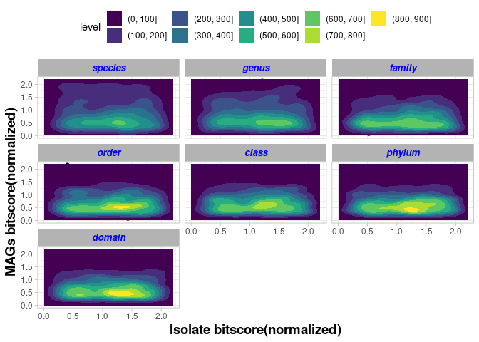
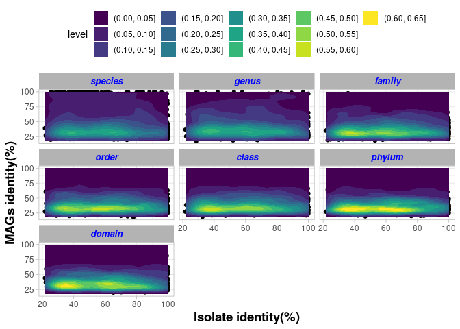

magdensity 2dplot
================

``` r
library(tidyverse)
library(ggplot2)
theme_set(
  theme_light() + theme(legend.position = "top")
)
# 1000 samples from the bacteria isolates and mags at different cultured levels
samp_bac <- read.csv("samp_all_2dmag_bac.csv")
# arranging based on factor
samp_bac$cultured_level<-factor(samp_bac$cultured_level, levels=c("species","genus","family","order","class","phylum","domain"))

# Bitscores
m <- ggplot(samp_bac, aes(x = bac_iso_norm, y = norm_bitscore)) +
 geom_point() +
 xlim(0.0, 2.2) +
 ylim(0.0, 2.2)


m + geom_density_2d_filled(contour_var = "count") +
  ylab("MAGs bitscore(normalized)")+
  xlab("Isolate bitscore(normalized)")+
  theme(
    axis.title.x = element_text(size = 14, face = "bold"),
    axis.title.y = element_text(size = 14, face = "bold")
    
  )+
  facet_wrap(vars(cultured_level))+
  theme(
    strip.text.x = element_text(
      size = 10, color = "blue", face = "bold.italic"
    ))
```

<!-- -->

``` r
## Identity

p <- ggplot(samp_bac, aes(x = bac_iso_ident, y = Pident_matches)) +
 geom_point() 


p + geom_density_2d_filled(contour_var = "count") +
  ylab("MAGs identity(%)")+
  xlab("Isolate identity(%)")+
  theme(
    axis.title.x = element_text(size = 14, face = "bold"),
    axis.title.y = element_text(size = 14, face = "bold")
    
  )+
  facet_wrap(vars(cultured_level))+
  theme(
    strip.text.x = element_text(
      size = 10, color = "blue", face = "bold.italic"
    ))
```

<!-- -->
